# Bookshelf Application - Technical Documentation

## Table of Contents
1. [Project Overview](#project-overview)
2. [Technology Stack](#technology-stack)
3. [Project Structure](#project-structure)
4. [Architecture](#architecture)
5. [Database Schema](#database-schema)
6. [Core Components](#core-components)
7. [API Endpoints](#api-endpoints)
8. [Data Flow](#data-flow)
9. [Configuration](#configuration)
10. [Build and Deployment](#build-and-deployment)
11. [Security Considerations](#security-considerations)

## Project Overview

**Bookshelf** is a web application that simulates a library management system built with the Beego framework (Go). The application enables users to borrow, return, and review books, while administrators have additional privileges to create, update, and delete books from the system.

### Key Features
- Role-based access control (Admin and User roles)
- Book management with copy tracking
- Book lending/returning system
- Review system for books
- ISBN-based book search using Google Books API
- Session-based authentication
- Flash messaging for user feedback

## Technology Stack

### Backend
- **Language**: Go 1.17
- **Web Framework**: Beego v2.0.2 (MVC framework for Go)
- **ORM**: Beego ORM
- **Database**: SQLite3
- **Validation**: govalidator (github.com/asaskevich/govalidator)
- **Testing**: GoConvey (github.com/smartystreets/goconvey)
- **Environment Management**: godotenv (github.com/joho/godotenv)

### Frontend
- **Template Engine**: Beego templates (.tpl files)
- **HTML/CSS**: Standard HTML with custom CSS
- **JavaScript**: Vanilla JavaScript for ISBN book search functionality

## Project Structure

```
/Users/juanca/code/bookshelf/bookshelf/
├── conf/                    # Configuration files
│   └── app.conf            # Application settings (port, mode, sessions)
├── controllers/            # Request handlers (MVC Controllers)
│   ├── default.go         # Main controller (index page)
│   ├── login.go           # Authentication controller
│   ├── book.go            # Book CRUD operations + ISBN search
│   ├── userbook.go        # Lend/return book operations
│   └── userbookreview.go  # Review operations
├── filters/               # Middleware
│   └── auth.go           # Authentication filter
├── forms/                # Form validation and processing
│   ├── iform.go          # Form interface
│   ├── book.go           # Book form with ISBN validation
│   ├── login.go          # Login form
│   └── review.go         # Review form
├── models/               # Data models (ORM entities)
│   ├── imodel.go         # Model interface
│   ├── book.go           # Book model with relationships
│   ├── user.go           # User model with authentication
│   ├── review.go         # Review model
│   └── role.go           # Role model (admin/user)
├── routers/              # Route definitions
│   └── router.go         # URL routing configuration
├── utils/                # Utility functions
│   └── db.go            # Database initialization with seed data
├── views/                # HTML templates
│   ├── index.tpl         # Main page with book listing
│   ├── login.tpl         # Login page
│   ├── form.tpl          # Generic form (books/reviews)
│   ├── reviews.tpl       # Review listing page
│   ├── head.html         # HTML head partial
│   ├── header.html       # Header partial
│   └── footer.html       # Footer partial
├── static/               # Static assets
│   ├── css/
│   │   └── bookshelf.css
│   └── js/
│       └── reload.min.js
├── tests/                # Test files
│   └── default_test.go   # Index and login tests
├── main.go               # Application entry point
├── go.mod                # Go module dependencies
├── go.sum                # Dependency checksums
└── bee.json              # Bee tool configuration
```

## Architecture

### MVC Pattern

The application follows a classic MVC (Model-View-Controller) architecture with clear separation of concerns:

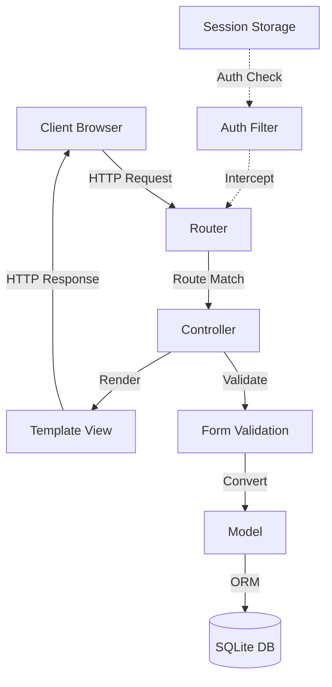

### Layer Responsibilities

#### Models Layer
- Defines data structures and database schema
- Implements business logic (lending, returning, authentication)
- Provides CRUD operations through ORM
- Manages relationships between entities

#### Controllers Layer
- Handles HTTP requests and responses
- Orchestrates interactions between models, forms, and views
- Manages session state
- Implements authorization checks

#### Forms Layer
- Validates user input
- Provides data sanitization
- Converts form data to model instances
- Custom validation logic (e.g., ISBN validation)

#### Views Layer
- Renders HTML templates
- Displays data from controllers
- Conditional rendering based on user state
- Includes reusable partials (head, header, footer)

#### Filters/Middleware
- Authentication enforcement
- Request interception
- Redirect logic for protected routes

## Database Schema

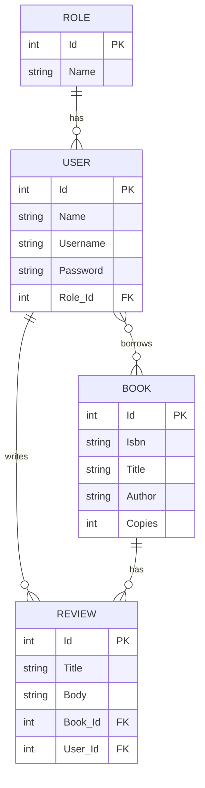

### Table Descriptions

#### Role Table
- **Purpose**: Defines user roles for access control
- **Fields**:
  - `Id`: Primary key
  - `Name`: Role name (unique) - "adm" for admin, "usr" for user

#### User Table
- **Purpose**: Stores user accounts and authentication data
- **Fields**:
  - `Id`: Primary key
  - `Name`: User's display name
  - `Username`: Login username (unique)
  - `Password`: User password (currently plaintext - security concern)
  - `Role_Id`: Foreign key to Role table
- **Relationships**:
  - Many-to-many with Book (through BooksLent join table)
  - One-to-many with Review

#### Book Table
- **Purpose**: Stores book catalog information
- **Fields**:
  - `Id`: Primary key
  - `Isbn`: International Standard Book Number (unique, validated)
  - `Title`: Book title
  - `Author`: Book author name
  - `Copies`: Total number of copies available
- **Relationships**:
  - Many-to-many with User (tracking who has borrowed books)
  - One-to-many with Review

#### Review Table
- **Purpose**: Stores user reviews for books
- **Fields**:
  - `Id`: Primary key
  - `Title`: Review title
  - `Body`: Review content
  - `Book_Id`: Foreign key to Book table
  - `User_Id`: Foreign key to User table
- **Relationships**:
  - Many-to-one with Book
  - Many-to-one with User

## Core Components

### 1. Models Layer

#### Book Model ([models/book.go](models/book.go))

**Structure**:
```go
type Book struct {
    Id      int
    Isbn    string  `orm:"unique"`
    Title   string
    Author  string
    Copies  int
    Users   []*User  `orm:"reverse(many)"`
    Reviews []*Review `orm:"reverse(many)"`
}
```

**Key Methods**:
- `AvailableCopies() int`: Calculates available copies by subtracting borrowed books from total copies
- `GetReviews() []*Review`: Loads all reviews for the book
- `All() []*Book`: Retrieves all books from database
- `Read(id int) *Book`: Fetches a single book by ID
- `Insert() error`: Creates a new book record
- `Update() error`: Updates existing book information
- `Delete() error`: Removes a book from the database

**Business Logic**:
- Tracks total copies vs. borrowed copies
- Maintains relationships with users and reviews
- Ensures ISBN uniqueness

#### User Model ([models/user.go](models/user.go))

**Structure**:
```go
type User struct {
    Id        int
    Name      string
    Username  string `orm:"unique"`
    Password  string
    Role      *Role `orm:"rel(fk)"`
    BooksLent []*Book `orm:"rel(m2m)"`
    Reviews   []*Review `orm:"reverse(many)"`
}
```

**Key Methods**:
- `DoLogin(username, password string) (*User, error)`: Authenticates user credentials and loads role
- `LendBook(bookId int) error`: Borrows a book if copies available and user doesn't already have it
- `ReturnBook(bookId int) error`: Returns a borrowed book
- `HasBook(bookId int) bool`: Checks if user currently has a specific book borrowed

**Business Logic**:
- Manages book lending with availability checks
- Prevents duplicate borrowing
- Handles authentication (WARNING: uses plaintext password comparison)

#### Review Model ([models/review.go](models/review.go))

**Structure**:
```go
type Review struct {
    Id    int
    Title string
    Body  string
    Book  *Book `orm:"rel(fk)"`
    User  *User `orm:"rel(fk)"`
}
```

**Key Methods**:
- `AllByBook(bookId int) []*Review`: Retrieves all reviews for a specific book
- `Insert() error`: Creates a new review

#### Role Model ([models/role.go](models/role.go))

**Structure**:
```go
type Role struct {
    Id   int
    Name string `orm:"unique"`
}
```

**Purpose**: Simple role-based access control with two predefined roles:
- "adm" (admin): Can create, edit, and delete books
- "usr" (user): Can lend, return, and review books

### 2. Controllers Layer

#### MainController ([controllers/default.go](controllers/default.go))

**Routes**: `/`, `/index`

**Functionality**:
- Displays the main page with book listing
- Shows user-specific information if logged in
- Displays flash messages (errors, notices)
- Renders different views based on authentication state

**Key Methods**:
- `Get()`: Renders index template with books and user data

#### LoginController ([controllers/login.go](controllers/login.go))

**Routes**: `/login`, `/logout`

**Functionality**:
- Handles user authentication
- Manages session creation and destruction
- Redirects based on login success/failure

**Key Methods**:
- `Get()`: Displays login form
- `Post()`: Processes login credentials using LoginForm
- `Logout()`: Destroys session and redirects to index

**Authentication Flow**:
1. User submits credentials via POST
2. Form validation and conversion to User model
3. `DoLogin()` verifies credentials
4. On success: Create session and redirect to index
5. On failure: Flash error message and redirect back to login

#### BookController ([controllers/book.go](controllers/book.go))

**Routes**: `/book/get`, `/book/new`, `/book/edit`, `/book/remove`, `/scrap/:isbn`

**Functionality**:
- CRUD operations for books
- ISBN-based book search using Google Books API
- Admin-only access for create/update/delete

**Key Methods**:
- `Get()`: Displays book form (create or edit mode)
- `New()`: Creates new book from form submission
- `Edit()`: Updates existing book
- `Remove()`: Deletes book (admin only)
- `SearchIsbn()`: External API call to fetch book details by ISBN

**Google Books API Integration**:
```go
// URL: https://www.googleapis.com/books/v1/volumes?q=isbn:{isbn}
// Returns: JSON with book title and author
// Frontend auto-fills form fields with returned data
```

#### UserBookController ([controllers/userbook.go](controllers/userbook.go))

**Routes**: `/book/lend`, `/book/return`

**Functionality**:
- Manages book lending and returning
- Enforces availability rules
- Updates user-book relationships

**Key Methods**:
- `LendBook()`: Lends a book to logged-in user
- `ReturnBook()`: Returns a borrowed book

**Lending Rules**:
- User must be authenticated
- Book must have available copies
- User cannot borrow same book twice

#### UserBookReviewController ([controllers/userbookreview.go](controllers/userbookreview.go))

**Routes**: `/review/get`, `/review/new`, `/review/list`

**Functionality**:
- Creates and displays book reviews
- Associates reviews with users and books

**Key Methods**:
- `Get()`: Displays review form
- `New()`: Creates new review from form submission
- `Reviews()`: Lists all reviews for a specific book

### 3. Forms Layer

#### Form Interface ([forms/iform.go](forms/iform.go))

**Purpose**: Defines standard interface for form handling

```go
type IForm interface {
    ToModel() (models.IModel, error)
}
```

**Key Function**:
- `ToModel(form IForm) (models.IModel, error)`: Validates form and converts to model instance

#### BookForm ([forms/book.go](forms/book.go))

**Fields**:
```go
type BookForm struct {
    Id     int
    Isbn   string `valid:"reqisbn"`
    Title  string `valid:"required"`
    Author string `valid:"required"`
    Copies int    `valid:"required"`
}
```

**Custom Validation**:
- `reqisbn` tag: Validates ISBN-10 or ISBN-13 format
- Custom validator registered in init()

**Conversion**: Transforms validated form data to Book model

#### LoginForm ([forms/login.go](forms/login.go))

**Fields**:
```go
type LoginForm struct {
    Username string `valid:"required"`
    Password string `valid:"required"`
}
```

**Conversion**: Creates User model with username and password for authentication

#### ReviewForm ([forms/review.go](forms/review.go))

**Fields**:
```go
type ReviewForm struct {
    Id     int
    Title  string `valid:"required"`
    Body   string `valid:"required"`
    BookId int
    UserId int
}
```

**Conversion**: Loads related Book and User models before creating Review

### 4. Filters/Middleware

#### AuthFilter ([filters/auth.go](filters/auth.go))

**Purpose**: Protects routes that require authentication

**Protected Routes**:
- `/logout`
- `/book/*` (all book operations)
- `/review/get`, `/review/new`

**Behavior**:
- Checks for user session
- Redirects to index page if not authenticated
- Allows request to continue if authenticated

**Implementation**:
```go
func FilterUser(ctx *context.Context) {
    _, ok := ctx.Input.Session("user").(models.User)
    if !ok {
        ctx.Redirect(302, "/")
    }
}
```

### 5. Routing

#### Router Configuration ([routers/router.go](routers/router.go))

**Basic Routes**:
```go
beego.Router("/", &controllers.MainController{})
beego.Router("/index", &controllers.MainController{})
beego.Router("/login", &controllers.LoginController{})
beego.Router("/logout", &controllers.LoginController{}, "get:Logout")
```

**Book Namespace** (`/book/*`):
```go
/book/get     → BookController.Get           # Display book form
/book/new     → BookController.New           # Create book
/book/edit    → BookController.Edit          # Update book
/book/remove  → BookController.Remove        # Delete book
/book/lend    → UserBookController.LendBook  # Lend book
/book/return  → UserBookController.ReturnBook # Return book
```

**Review Namespace** (`/review/*`):
```go
/review/get   → UserBookReviewController.Get     # Display review form
/review/new   → UserBookReviewController.New     # Create review
/review/list  → UserBookReviewController.Reviews # List reviews
```

**Special Routes**:
```go
/scrap/:isbn  → BookController.SearchIsbn   # Google Books API lookup
```

### 6. Views Layer

#### Templates

**index.tpl** ([views/index.tpl](views/index.tpl))
- Main page displaying book table
- Conditional rendering based on user authentication
- Role-based actions (admin: edit/delete, user: lend/return)
- Flash message display

**login.tpl** ([views/login.tpl](views/login.tpl))
- Login form with username and password fields
- Error message display from flash

**form.tpl** ([views/form.tpl](views/form.tpl))
- Generic form for books and reviews
- ISBN auto-fill feature for books
- JavaScript integration with Google Books API

**reviews.tpl** ([views/reviews.tpl](views/reviews.tpl))
- Displays all reviews for a specific book
- Shows review title, body, and author
- Link back to main page

**Partials**:
- `head.html`: Common HTML head with CSS includes
- `header.html`: Application header with navigation
- `footer.html`: Application footer with copyright

**Custom Template Functions**:
- `HasBook`: Checks if logged-in user has borrowed a specific book

### 7. Application Entry Point

#### main.go ([main.go](main.go))

**Initialization Sequence**:

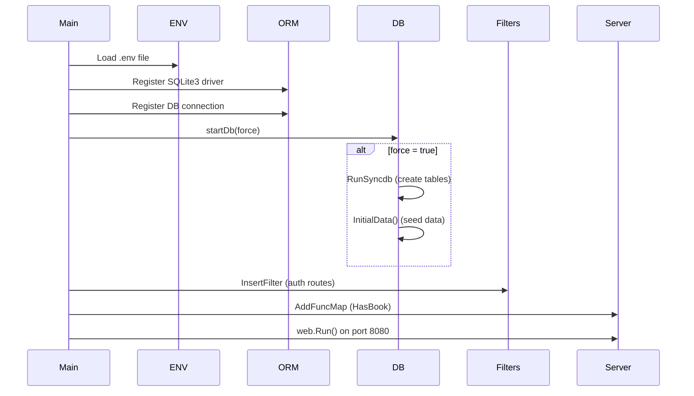

**Key Initialization Steps**:
1. Load environment variables from `.env`
2. Register SQLite3 database driver
3. Register database connection with ORM
4. Initialize database (create tables and seed data if needed)
5. Register authentication filter for protected routes
6. Add custom template function `HasBook`
7. Start web server

**Environment Variables**:
- `DB_INITIAL_FORCE`: Controls database initialization
  - `true`: Drop and recreate tables, seed initial data
  - `false`: Use existing database

### 8. Database Utilities

#### db.go ([utils/db.go](utils/db.go))

**Functions**:

**startDb(force bool)**:
- Initializes database connection
- Creates tables if force=true
- Seeds initial data if force=true

**InitialData()**:
- Creates default roles: "adm", "usr"
- Creates default users:
  - Admin: username=admin, password=admin, role=adm
  - Test: username=test, password=test, role=usr

**Model Registration**:
```go
orm.RegisterModel(
    new(models.Role),
    new(models.User),
    new(models.Book),
    new(models.Review),
)
```

## API Endpoints

### Complete Endpoint Reference

| Method | Endpoint | Controller | Auth Required | Admin Only | Description |
|--------|----------|------------|---------------|------------|-------------|
| GET | `/` | MainController | No | No | Home page with book listing |
| GET | `/index` | MainController | No | No | Same as `/` |
| GET | `/login` | LoginController | No | No | Display login form |
| POST | `/login` | LoginController | No | No | Process login credentials |
| GET | `/logout` | LoginController | Yes | No | Logout and destroy session |
| GET | `/book/get` | BookController | Yes | No | Display book form (create/edit) |
| POST | `/book/new` | BookController | Yes | Yes | Create new book |
| POST | `/book/edit` | BookController | Yes | Yes | Update existing book |
| GET | `/book/remove` | BookController | Yes | Yes | Delete book |
| GET | `/book/lend` | UserBookController | Yes | No | Borrow a book |
| GET | `/book/return` | UserBookController | Yes | No | Return a borrowed book |
| GET | `/review/get` | UserBookReviewController | Yes | No | Display review form |
| POST | `/review/new` | UserBookReviewController | Yes | No | Create new review |
| GET | `/review/list` | UserBookReviewController | No | No | List all reviews for a book |
| GET | `/scrap/:isbn` | BookController | Yes | No | Search book by ISBN via Google Books API |

### Endpoint Details

#### Book Management

**Create Book**:
```
POST /book/new
Content-Type: application/x-www-form-urlencoded

isbn=9781234567890&title=Book Title&author=Author Name&copies=5
```

**Update Book**:
```
POST /book/edit
Content-Type: application/x-www-form-urlencoded

id=1&isbn=9781234567890&title=Updated Title&author=Author Name&copies=10
```

**Delete Book**:
```
GET /book/remove?id=1
```

#### Book Lending

**Lend Book**:
```
GET /book/lend?bookid=1
```

**Return Book**:
```
GET /book/return?bookid=1
```

#### Review Management

**Create Review**:
```
POST /review/new
Content-Type: application/x-www-form-urlencoded

title=Great Book&body=This book was amazing!&bookid=1
```

**List Reviews**:
```
GET /review/list?bookid=1
```

#### External API

**ISBN Search**:
```
GET /scrap/9781234567890

Response:
{
  "title": "Book Title",
  "author": "Author Name"
}
```

## Data Flow

### User Login Flow

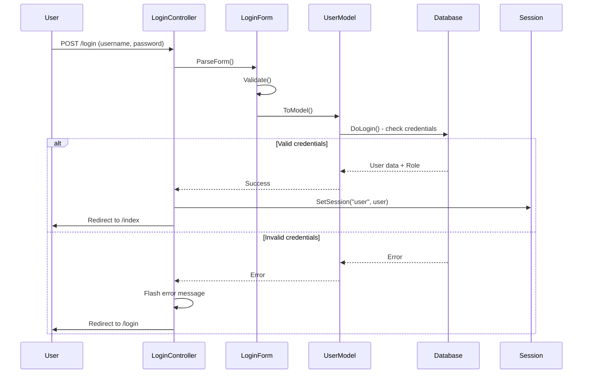

### Book Lending Flow

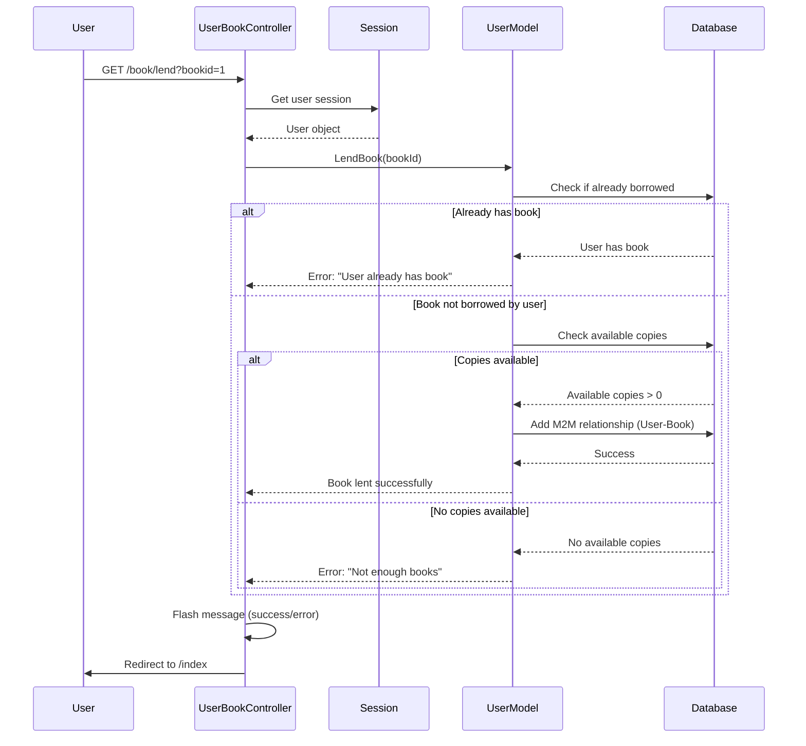

### Book Return Flow

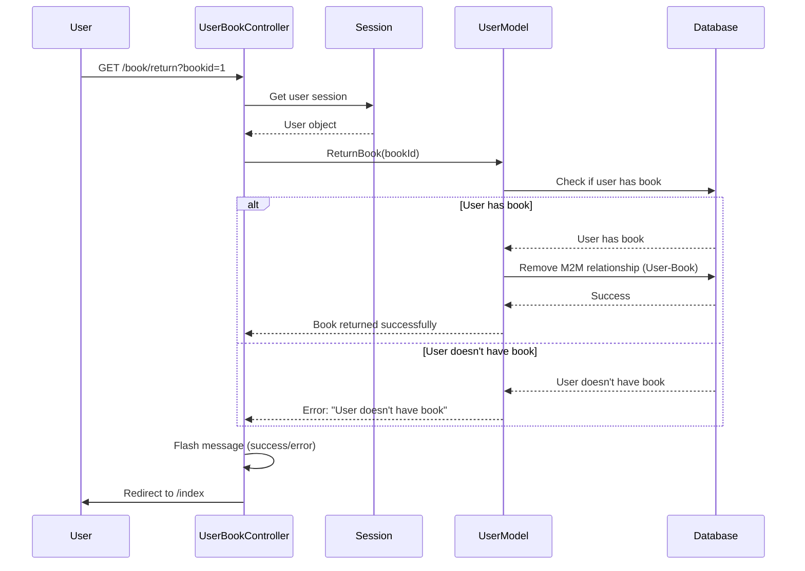

### ISBN Search Flow (External API)

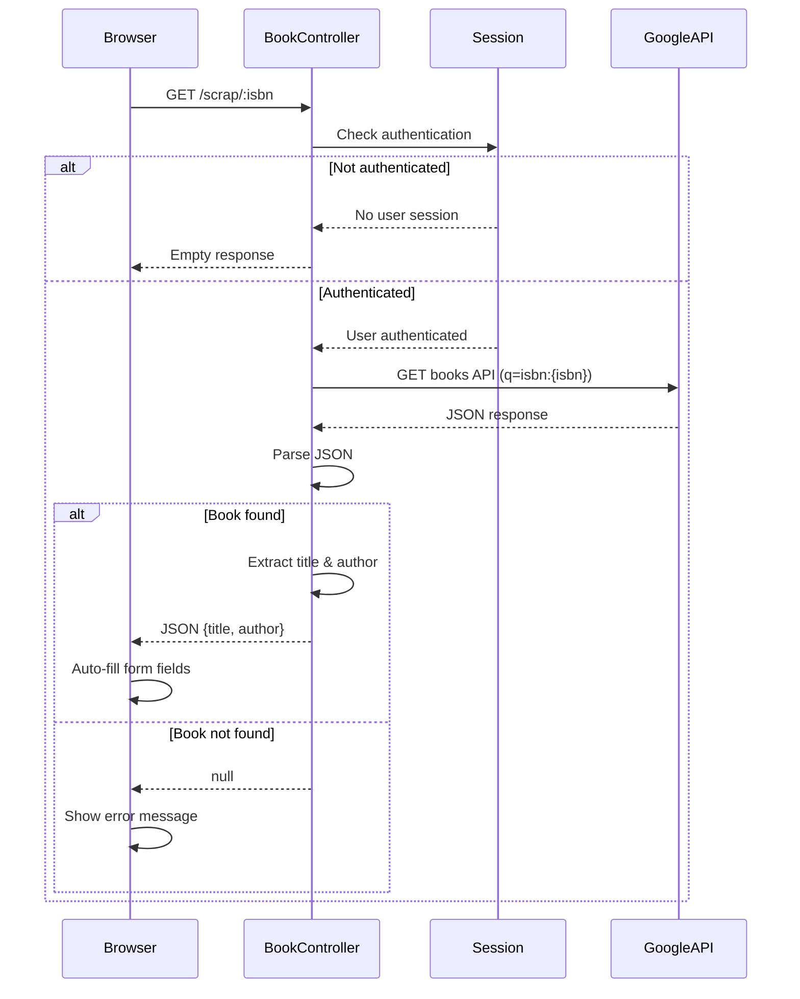

### Review Creation Flow

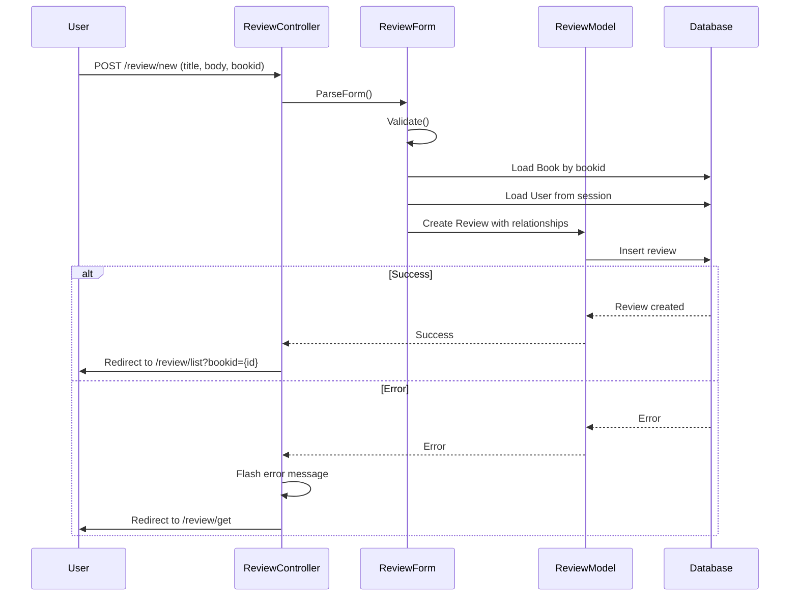

## Configuration

### Application Configuration ([conf/app.conf](conf/app.conf))

```ini
appname = bookshelf
httpport = 8080
httpaddr = "localhost"
SessionOn = true
runmode = dev
```

**Parameters**:
- `appname`: Application name (used in logs and templates)
- `httpport`: Port on which the server listens (default: 8080)
- `httpaddr`: Host address (localhost for development)
- `SessionOn`: Enable session management (required for authentication)
- `runmode`: Application mode (dev, prod)
  - `dev`: Development mode with auto-reload
  - `prod`: Production mode with optimizations

### Bee Tool Configuration ([bee.json](bee.json))

```json
{
  "version": "0",
  "gopm": {
    "enable": false,
    "install": false
  },
  "go_install": false,
  "watch_ext": [],
  "dir_structure": {},
  "cmd_args": [],
  "envs": [],
  "database": {
    "driver": "sqlite3"
  },
  "enable_reload": false,
  "enable_notification": false
}
```

### Environment Configuration (.env)

```bash
DB_INITIAL_FORCE=true  # Set to true for first run, false thereafter
```

**Purpose**:
- `DB_INITIAL_FORCE=true`: Drops existing tables, recreates schema, seeds initial data
- `DB_INITIAL_FORCE=false`: Uses existing database without modifications

## Build and Deployment

### Prerequisites
- Go 1.17 or higher
- GCC compiler (for SQLite CGO)
- Bee tool (optional, for development)

### Installation

1. **Clone the repository**:
```bash
git clone <repository-url>
cd bookshelf
```

2. **Install dependencies**:
```bash
go mod download
```

3. **Create environment file**:
```bash
echo "DB_INITIAL_FORCE=true" > .env
```

4. **Build the application**:
```bash
go build -o bookshelf
```

### Running the Application

**First Run** (creates database and seeds data):
```bash
DB_INITIAL_FORCE=true ./bookshelf
```

**Subsequent Runs** (uses existing database):
```bash
DB_INITIAL_FORCE=false ./bookshelf
```

Or set it in `.env` file and run:
```bash
./bookshelf
```

**Access the application**:
```
http://localhost:8080
```

### Development Mode

Using Bee tool for auto-reload:
```bash
bee run
```

### Testing

Run tests:
```bash
cd tests
go test -v
```

**Test Coverage**:
- Index page rendering (with/without books)
- Login flow (correct/incorrect credentials)
- Redirect validation
- Flash message validation

### Production Deployment

1. **Set production mode** in `conf/app.conf`:
```ini
runmode = prod
```

2. **Build optimized binary**:
```bash
go build -ldflags="-s -w" -o bookshelf
```

3. **Set environment**:
```bash
export DB_INITIAL_FORCE=false
```

4. **Run with process manager** (e.g., systemd, supervisor):
```bash
./bookshelf
```

### Database Management

**Location**: SQLite database file is created in the project root as `bookshelf.db`

**Initial Data**:
- 2 Roles: "adm" (admin), "usr" (user)
- 2 Users:
  - Admin: username=`admin`, password=`admin`
  - Test: username=`test`, password=`test`

**Reset Database**:
1. Stop the application
2. Delete `bookshelf.db`
3. Set `DB_INITIAL_FORCE=true`
4. Restart the application

## Security Considerations

### Current Security Issues

#### Critical

1. **Plaintext Password Storage**
   - **Issue**: Passwords are stored and compared in plaintext
   - **Location**: [models/user.go:41](models/user.go#L41)
   - **Risk**: Complete password exposure in case of database breach
   - **TODO**: Implement bcrypt password hashing
   - **Recommendation**:
   ```go
   // Use golang.org/x/crypto/bcrypt
   hashedPassword, _ := bcrypt.GenerateFromPassword([]byte(password), bcrypt.DefaultCost)
   err := bcrypt.CompareHashAndPassword([]byte(user.Password), []byte(password))
   ```

2. **No CSRF Protection**
   - **Issue**: Forms don't include CSRF tokens
   - **Risk**: Cross-Site Request Forgery attacks
   - **Recommendation**: Enable Beego's built-in CSRF middleware

3. **SQL Injection**
   - **Status**: Protected by Beego ORM
   - **Note**: All database queries use ORM, which provides parameterization

#### Medium

4. **Session Security**
   - **Issue**: No session timeout or expiration
   - **Issue**: Session stored in memory (lost on restart)
   - **Recommendation**: Use Redis or database for session storage
   - **Recommendation**: Implement session timeout

5. **No Rate Limiting**
   - **Issue**: API endpoints unprotected against brute force
   - **Risk**: Login brute force attacks
   - **Recommendation**: Implement rate limiting middleware

6. **No Input Sanitization for HTML**
   - **Issue**: User-generated content (reviews) not sanitized
   - **Risk**: XSS (Cross-Site Scripting) attacks
   - **Recommendation**: Sanitize HTML in review body/title before rendering

#### Low

7. **Hardcoded Credentials in Seed Data**
   - **Issue**: Default admin credentials (admin/admin) in production
   - **Recommendation**: Force password change on first login or use environment variables

8. **No HTTPS Enforcement**
   - **Issue**: Application runs on HTTP
   - **Recommendation**: Use reverse proxy (nginx) with SSL/TLS in production

### Security Best Practices to Implement

1. **Password Hashing**:
```go
import "golang.org/x/crypto/bcrypt"

func (u *User) SetPassword(password string) error {
    hashedPassword, err := bcrypt.GenerateFromPassword([]byte(password), bcrypt.DefaultCost)
    if err != nil {
        return err
    }
    u.Password = string(hashedPassword)
    return nil
}

func (u *User) CheckPassword(password string) bool {
    err := bcrypt.CompareHashAndPassword([]byte(u.Password), []byte(password))
    return err == nil
}
```

2. **CSRF Protection** in `conf/app.conf`:
```ini
EnableXSRF = true
XSRFKey = your-secret-key-here
XSRFExpire = 3600
```

3. **Session Configuration** in `conf/app.conf`:
```ini
SessionProvider = redis
SessionProviderConfig = 127.0.0.1:6379
SessionCookieLifeTime = 3600
SessionAutoSetCookie = true
SessionDomain = ""
```

4. **HTML Sanitization**:
```go
import "html"

// Before saving review
review.Body = html.EscapeString(review.Body)
review.Title = html.EscapeString(review.Title)
```

5. **Rate Limiting Middleware**:
```go
// Implement rate limiting filter for login endpoint
func RateLimitFilter(ctx *context.Context) {
    // Implement rate limiting logic
}
```

### Authentication Flow Security

**Current Implementation**:
- Session-based authentication
- User object stored in session
- Authentication checked via filter

**Vulnerabilities**:
- No session fixation protection
- No remember-me token security
- No account lockout after failed attempts

**Recommendations**:
- Regenerate session ID after login
- Implement account lockout (e.g., 5 failed attempts)
- Add "remember me" with secure tokens
- Implement logout on all devices functionality

## Application Features

### Role-Based Access Control

#### Admin Role ("adm")
**Capabilities**:
- View all books
- Create new books
- Edit existing books
- Delete books
- Lend/return books (same as users)
- Write reviews (same as users)

**UI Differences**:
- "Edit" and "Delete" buttons visible for all books
- Access to book creation form

#### User Role ("usr")
**Capabilities**:
- View all books
- Lend books (if copies available)
- Return borrowed books
- Write reviews for books
- View all reviews

**UI Differences**:
- "Lend" button for books not yet borrowed
- "Return" button for borrowed books
- No edit/delete capabilities

### Book Management Features

#### ISBN Validation
- Supports ISBN-10 (10 digits)
- Supports ISBN-13 (13 digits)
- Custom validator registered with govalidator
- Enforces uniqueness in database

#### Copy Tracking
- Tracks total copies per book
- Calculates available copies dynamically
- Formula: `Available = Total - Borrowed`
- Prevents lending when no copies available

#### Google Books API Integration
- Auto-fills book title and author from ISBN
- Endpoint: `https://www.googleapis.com/books/v1/volumes?q=isbn:{isbn}`
- JavaScript-based form auto-fill
- Fallback to manual entry if API fails

### Review System

#### Features
- Users can write reviews for any book
- Reviews include title and body
- Reviews associated with user and book
- Display all reviews for a specific book

#### Validation
- Title: Required field
- Body: Required field
- User: Automatically set from session
- Book: Must exist in database

### Session Management

#### Flash Messages
**Types**:
- Error messages (login failures, validation errors)
- Notice messages (success confirmations)

**Display**:
- Shown at top of page
- Automatically cleared after display
- CSS-styled for visibility

#### User Session
**Stored Data**:
- User ID
- Username
- Name
- Role information

**Session Lifecycle**:
- Created on successful login
- Persisted across requests
- Destroyed on logout

## Technical Diagrams

### Application Architecture

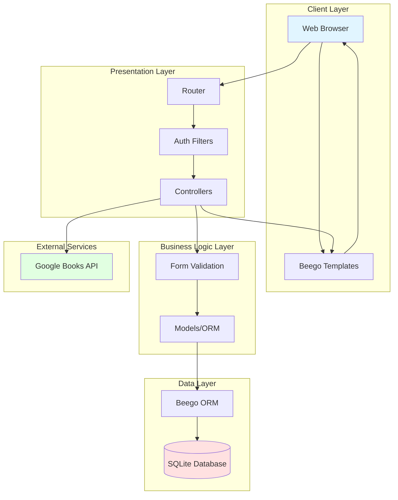

### Request Lifecycle

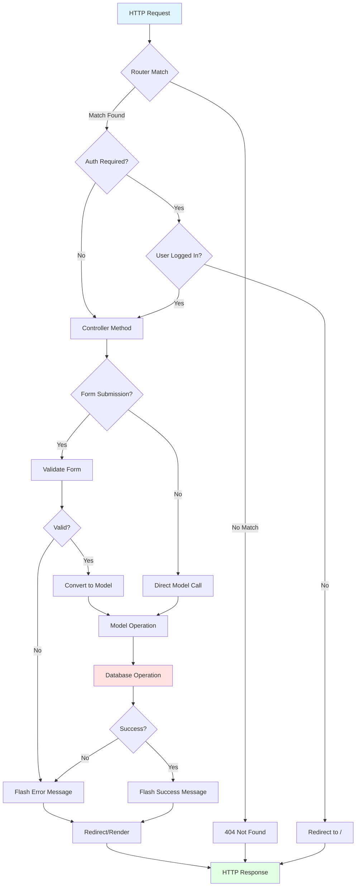

### Database Relationship Diagram (Detailed)

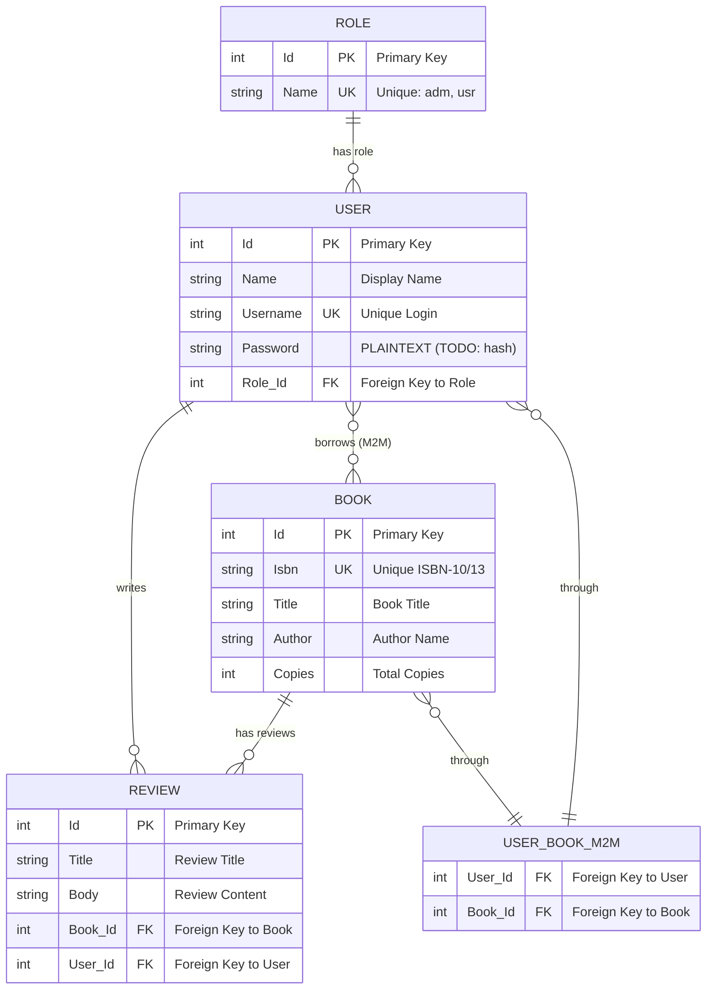

## Code Quality and Testing

### Current Test Coverage

**Test Files**:
- [tests/default_test.go](tests/default_test.go)

**Test Cases**:
1. **TestBeforeIndex**: Tests index page with no books
2. **TestIndex**: Tests index page with books in database
3. **TestLogin**: Tests correct login credentials
4. **TestLoginFail**: Tests incorrect login credentials

**Coverage Areas**:
- HTTP response codes
- Page rendering
- Session creation
- Flash messages
- Redirects

### Missing Test Coverage

**Critical Areas Needing Tests**:
1. Book CRUD operations
2. Book lending/returning logic
3. Review creation
4. ISBN validation
5. Google Books API integration
6. Available copies calculation
7. Authorization checks (admin-only operations)
8. Edge cases (e.g., returning non-borrowed book)

### Code Quality Observations

**Strengths**:
- Clear separation of concerns (MVC)
- Consistent naming conventions
- ORM usage prevents SQL injection
- Form validation layer
- Reusable components

**Areas for Improvement**:
1. **Error Handling**: Some functions return errors that aren't always checked
2. **Security**: Password hashing needed urgently
3. **Test Coverage**: Needs expansion to cover business logic
4. **Documentation**: Minimal code comments
5. **Configuration**: Some values hardcoded (e.g., Google API URL)
6. **Logging**: Minimal logging for debugging production issues

### Recommended Improvements

1. **Add comprehensive tests**:
```go
func TestLendBook(t *testing.T) {
    // Test successful lending
    // Test lending when no copies available
    // Test duplicate lending prevention
    // Test unauthorized access
}
```

2. **Implement logging**:
```go
import "github.com/beego/beego/v2/core/logs"

logs.Info("User %s borrowed book %d", user.Username, bookId)
logs.Error("Failed to lend book: %v", err)
```

3. **Add configuration management**:
```go
// conf/app.conf
google_books_api_url = https://www.googleapis.com/books/v1/volumes
google_books_api_key = your-api-key-here
```

4. **Implement error middleware**:
```go
func ErrorHandler(ctx *context.Context) {
    // Log errors
    // Return user-friendly error pages
    // Handle 404, 500, etc.
}
```

## Conclusion

The Bookshelf application is a well-structured MVC web application built with Beego framework. It demonstrates solid architectural patterns with clear separation of concerns, proper use of ORM, and basic authentication/authorization.

### Strengths
- Clean MVC architecture
- Role-based access control
- Form validation layer
- External API integration (Google Books)
- Session management
- Flash messaging system

### Critical Improvements Needed
1. **Security**: Implement password hashing immediately
2. **Testing**: Expand test coverage significantly
3. **Error Handling**: Improve error handling and user feedback
4. **Documentation**: Add code comments and API documentation
5. **Configuration**: Externalize hardcoded values
6. **Logging**: Add comprehensive logging for debugging

### Future Enhancements
- Implement CSRF protection
- Add rate limiting
- Improve session security
- Add pagination for book listing
- Implement search/filter functionality
- Add book categories/genres
- Implement email notifications
- Add password reset functionality
- Create admin dashboard
- Add book cover image support

This codebase provides a solid foundation for a library management system and can be extended with additional features while maintaining its clean architecture.